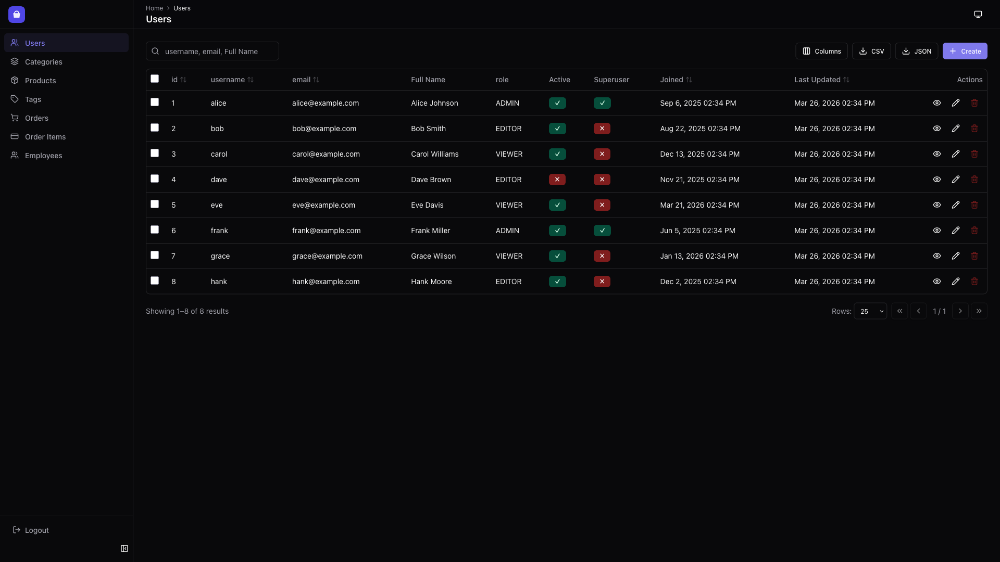
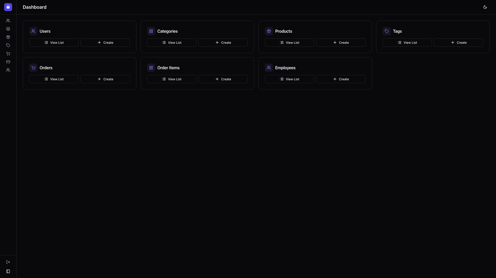

<p align="center">
<a href="https://github.com/senzmaki/spa-sqladmin">
    
</a>
</p>

<p align="center">
<a href="https://github.com/senzmaki/spa-sqladmin/actions">
    
</a>
<a href="https://github.com/senzmaki/spa-sqladmin/actions">
    
</a>
<a href="https://codecov.io/gh/SenZmaKi/spa-sqladmin">
    
</a>
<a href="https://pypi.org/project/spa-sqladmin/">
    
</a>
<a href="https://pypi.org/project/spa-sqladmin" target="_blank">
    
</a>
</p>

---

# spa-sqladmin: React SPA Admin for Starlette/FastAPI

`spa-sqladmin` is a modern admin interface for SQLAlchemy models backed by a React SPA frontend.

Main features include:

* [SQLAlchemy](https://github.com/sqlalchemy/sqlalchemy) sync/async engines
* [Starlette](https://github.com/encode/starlette) integration
* [FastAPI](https://github.com/tiangolo/fastapi) integration
* [WTForms](https://github.com/wtforms/wtforms) form building
* [SQLModel](https://github.com/tiangolo/sqlmodel) support
* Modern React SPA UI with [Shadcn UI](https://ui.shadcn.com/), [Tanstack Router](https://tanstack.com/router), [Tanstack Table](https://tanstack.com/table), and [Tanstack Query](https://tanstack.com/query)

---

**Documentation**: [https://senzmaki.github.io/spa-sqladmin](https://senzmaki.github.io/spa-sqladmin)

**Source Code**: [https://github.com/SenZmaKi/spa-sqladmin](https://github.com/SenZmaKi/spa-sqladmin)

---

## Installation

```shell
$ pip install git+https://github.com/SenZmaKi/spa-sqladmin.git
# with optional dependencies
$ pip install "spa-sqladmin[full] @ git+https://github.com/SenZmaKi/spa-sqladmin.git"
```

---

## Screenshots




## Quickstart

Let's define an example SQLAlchemy model:

```python
from sqlalchemy import Column, Integer, String, create_engine
from sqlalchemy.orm import declarative_base


Base = declarative_base()
engine = create_engine(
    "sqlite:///example.db",
    connect_args={"check_same_thread": False},
)


class User(Base):
    __tablename__ = "users"

    id = Column(Integer, primary_key=True)
    name = Column(String)


Base.metadata.create_all(engine)  # Create tables
```

If you want to use `spa-sqladmin` with `FastAPI`:

```python
from fastapi import FastAPI
from spa_sqladmin import Admin, ModelView


app = FastAPI()
admin = Admin(app, engine)


class UserAdmin(ModelView, model=User):
    column_list = [User.id, User.name]


admin.add_view(UserAdmin)
```

Or if you want to use `spa-sqladmin` with `Starlette`:

```python
from spa_sqladmin import Admin, ModelView
from starlette.applications import Starlette


app = Starlette()
admin = Admin(app, engine)


class UserAdmin(ModelView, model=User):
    column_list = [User.id, User.name]


admin.add_view(UserAdmin)
```

Now visiting `/admin` on your browser you can see the `spa-sqladmin` interface.

For a full overview of `Admin(...)` parameters, icon formats, palette syntax, and custom admin patterns, see the [Usage Guide](USAGE.md).

## Related projects and inspirations

* [Flask-Admin](https://github.com/flask-admin/flask-admin) Admin interface for Flask supporting different database backends and ORMs. This project has inspired spa-sqladmin extensively and most of the features and configurations are implemented the same.
* [FastAPI-Admin](https://github.com/fastapi-admin/fastapi-admin) Admin interface for FastAPI which works with `TortoiseORM`.
* [Dashboard](https://github.com/encode/dashboard) Admin interface for ASGI frameworks which works with the `orm` package.
